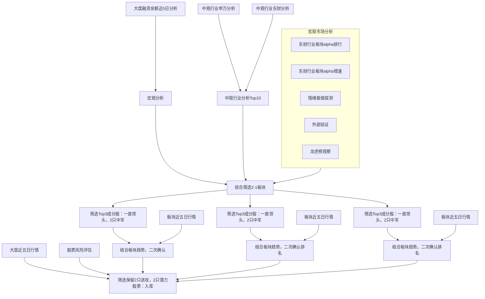

```mermaid
graph TD
    subgraph A1[宏观市场分析]
        Child1[市场量能判定]
        Child2[风格与赚钱效应]
        Child3[情绪极值探测]
        Child4[外部验证]
        Child5[获取5日内大盘趋势]
        Child5[龙虎榜观察]
    end
    subgraph B1[中观行业申万分析]
        Child1[申万二级行业alpha排行]
        Child2[申万二级行业alpha增速排行]
        
    end
    subgraph B2[中观行业东财分析]
        Child1[东财行业板块alpha排行]
        Child2[东财行业板块alpha增速]
    end
    A1-->C[宏观分析];
    A2[大盘融资余额近5日分析]-->A[宏观分析]
    B1[申万二级行业alpha分析]-->B[中观行业分析Top10]
    B2[东财行业alpha分析]-->B[中观行业分析Top10]
    A-->C[综合筛选2-1板块]
    B-->C[综合筛选2-1板块]
    C-->D1[筛选Top3成分股：一直领头，2只中军]
    C-->D2[筛选Top3成分股：一直领头，2只中军]
    C-->D3[筛选Top3成分股：一直领头，2只中军]
    D1-->D10[结合板块趋势，二次确认]
    D2-->D20[结合板块趋势，二次确认排名]
    D3-->D30[结合板块趋势，二次确认排名]
    D11[板块近五日行情]-->D10
    D22[板块近五日行情]-->D20
    D33[板块近五日行情]-->D30
    D5[大盘近五日行情]-->D
    D6[股票风险评估]-->D
    D10-->D[筛选保留2只进攻，2只潜力股票：入库]
    D20-->D[筛选保留2只进攻，2只潜力股票：入库]
    D30-->D[筛选保留2只进攻，2只潜力股票：入库]

```